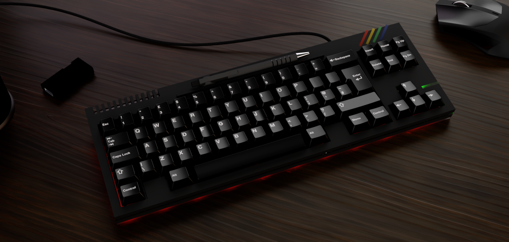
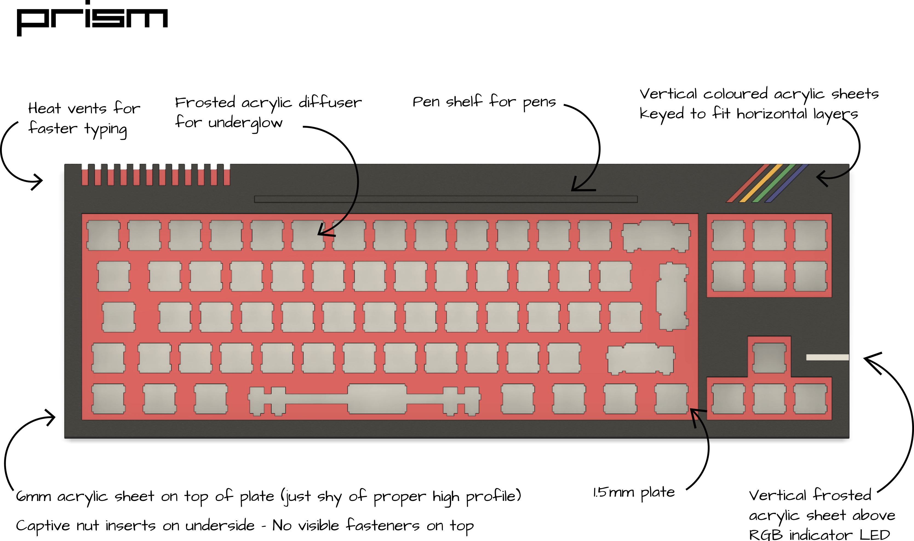

# Prism Mechanical Keyboard

Prism is a low cost QMK compatable 60% + nav cluster (or TKL minus F-row if you prefer) keyboard.

It came about for a number of reasons:

 * I had some [TGW71 PCBs](https://www.reddit.com/r/MechanicalKeyboards/comments/5un33s/the_great_wave_custom_board/) designed by [u/ca178858](https://www.reddit.com/user/ca178858) lying around doing nothing
 * I am procrastinating instead of doing my PhD thesis writeup
 * There was a competition on [r/CustomKeyboards](https://www.reddit.com/r/CustomKeyboards/) to build retro themed keyboards.

As it was planned for the OG Summer competition I decided to emulate some of the design language of the [ZX Sepctrum](https://imgur.com/a/drfZssH) family of computers (particularly the the ones that came after the 48k).

## Initial Design document

## Plans

Currently this repo is a bit of a dumping ground for what I have designed so far, though it is possible to recreate the keyboard entirely. Eventually I want it to include:

* Multiple plate layer configurations
* Multiple top layer configuations
* Changes to the PCB to include PCB mount stabilisers

## Current status

Prototype complete - Displaying at Mechanical Keyboard Meetup (Leeds 26/10/2019)

## Posts about Prism

*[Initial](https://www.reddit.com/r/CustomKeyboards/comments/c7dlp8/ogsummer_zx_spectrum_inspired_work_in_progress/)
*[Update](https://www.reddit.com/r/CustomKeyboards/comments/cu45r6/ogsummer_prism_zx_spectrum_inspired_update/)
*[Keebtalk](https://www.keebtalk.com/t/prism-a-zx-spectrum-inspired-low-cost-acrylic-case/)
